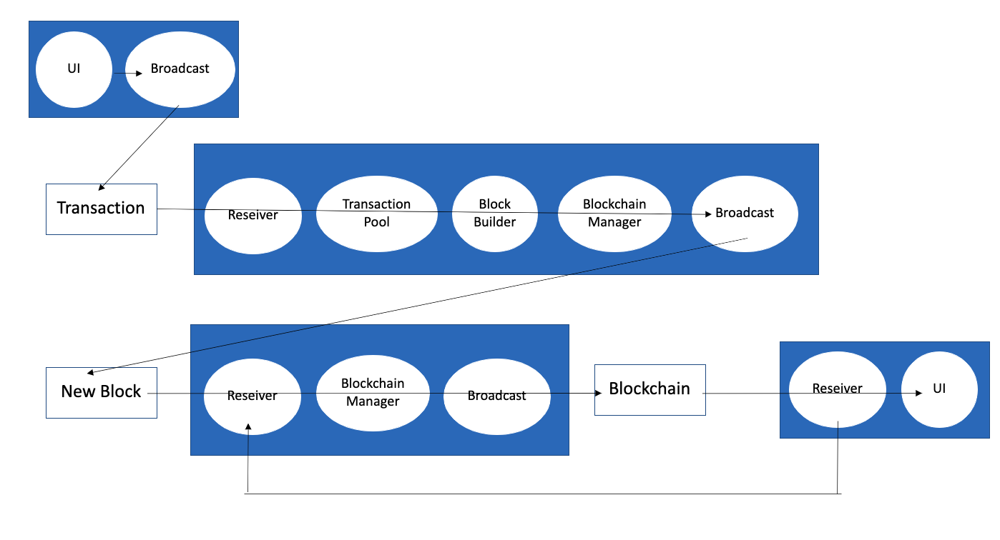
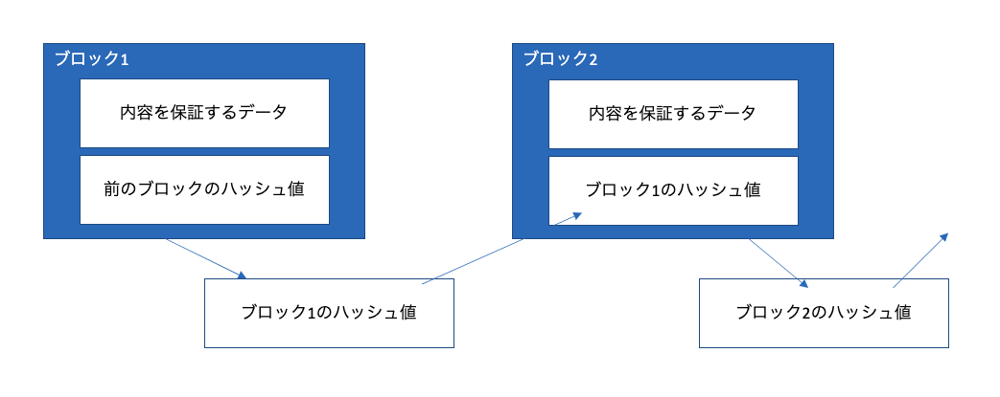

# ブロックチェーンを作る

今回作成するブロックチェーンの全体像。

この内、BroadcastとRceiverはP2Pネットワークの機能として提供する。

ブロックチェーンとは、下図のような構造を持つ、データ（＝ブロック）の連鎖。

ハッシュ値とは、ある入力に対してハッシュ関数が返却する出力であり、その出力から入力を特定することが非常に困難である値。

ブロック1の内容を、ブロックチェーンを作ったあとで変更すると、ブロック2が持つハッシュ値と、実際にブロック1から計算したハッシュ値が一致しなくなる。こうした仕組みによって、ブロック、あるいはブロックチェーンの非改竄性を担保している。
（後続のブロックのハッシュ値をすべて再計算すれば全体で一貫性がある
ように見えてしまうので、対策が必要）

ブロックチェーンには始原のブロック=Genesisブロックが存在し、そのブロックにはハッシュ値がセットされない。
